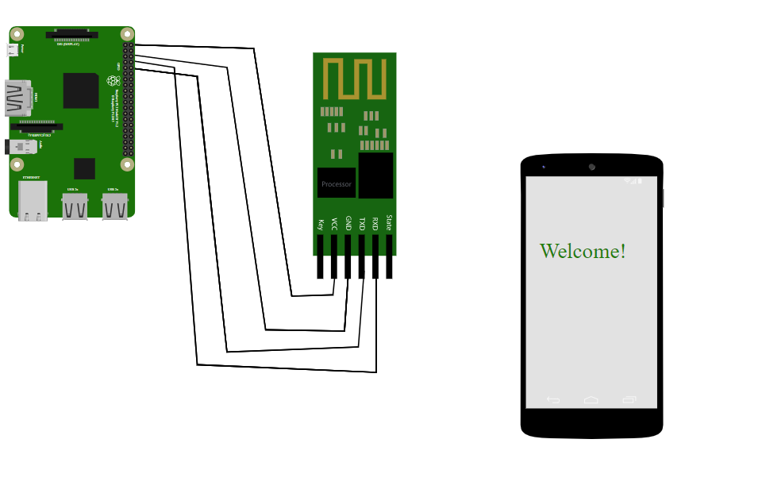
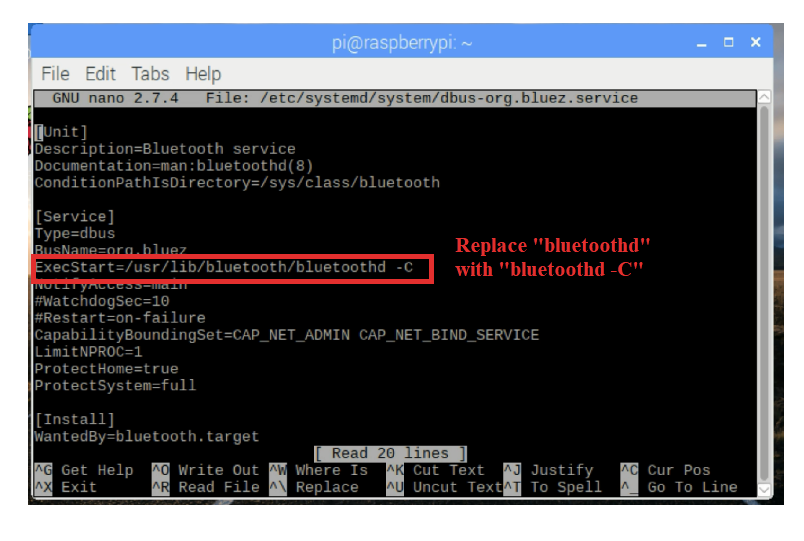
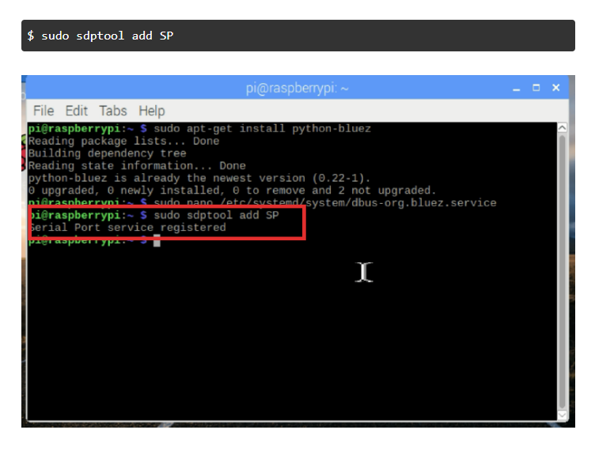
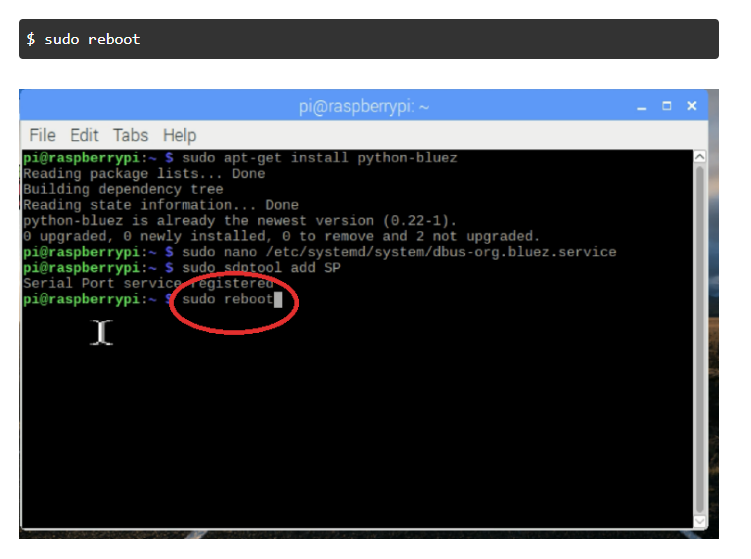
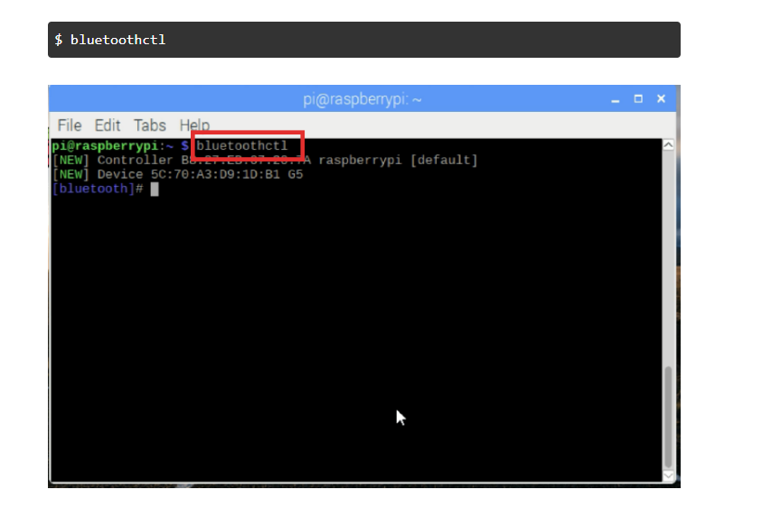
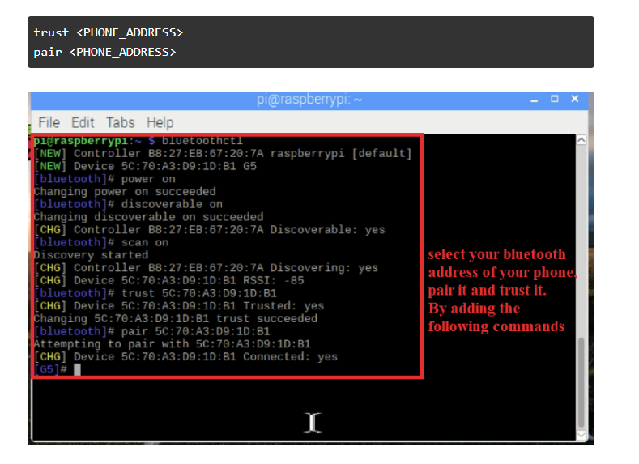

### Procedure

##### Hardware Setup

- Connect the Vcc of HC-05 Bluetooth Sensor to the 5V PWR of Raspberry Pi
- Connect the TX pin of HC-05 Bluetooth Sensor to the UART0 RX pin of Raspberry Pi
- Connect the RX pin of HC-05 Bluetooth Sensor to the UART0 TX pin of Raspberry Pi
- Connect the GND pin of HC-05 Bluetooth Sensor to the GND pin of Raspberry Pi
- Click the Bluetooth icon on the smartphone to turn on Bluetooth
- Turn on Bluetooth by clicking the switch on the smartphone screen
- Select Raspberry Pi from the available devices
- Click the pair option to pair the smartphone

 

- After completing the circuit, the user can enter the data into the code, and it will be transferred to the smartphone via Bluetooth, displaying on the smartphone.

##### software Setup

1. Setting up Raspberry Pi’s Bluetooth - In the beginning, you'll need a monitor + keyboard connected, alternative access the Raspberry Pi over SSH just to be able to establish all the configurations required through the Raspbian Terminal.
   Run the commands below carefully to establish the proper configurations:

- Install bluez (Python bluetooth library)
- $ sudo apt-get install python-bluez

2. Start the Bluetooth daemon in compatibility mode. To do this, edit /etc/systemd/system/dbus-org.bluez.service, by running the command below:
   $ sudo nano /etc/systemd/system/dbus-org.bluez.service
3. Then, modify the ExecStart param:
   ExecStart=/usr/lib/bluetooth/bluetoothd –C
   

4. Now, load the serial port profile by using the command below:
   $ sudo sdptool add SP

 
5. To save the changes properly, restart your Pi:
$ sudo reboot

 
After the Rebooting let us pair the Bluetooth with our android phone

1. Pairing Raspberry Pi and Android Phone.
Pair your Android phone with your Raspberry Pi. To do this, turn your phone's bluetooth on, and run the command below in your Pi:

 
Then, once the pairing process starts inserting the following parameters. (Refer to the image to get a better idea of the flow process)

- power on
- discoverable on
- scan on
- At this point, your phone will appear in the list of available devices. Take note of the address of your phone.
- trust <PHONE_ADDRESS>
- pair <PHONE_ADDRESS>

2. For just exit the bluetooth ctl, write the quit command:
   $ quit
3. You can skip the above setup, by setting up the Bluetooth with UI of Raspbian. Just press the Bluetooth icon, and select your phone Bluetooth.

Python Code

    import bluetooth
    def start_bluetooth_server():
     server_sock = bluetooth.BluetoothSocket(bluetooth.RFCOMM)

    port = 1  # You can use any available port

    server_sock.bind(("", port))
    server_sock.listen(1)

    print("Waiting for Bluetooth connection...")

    client_sock, client_info = server_sock.accept()
    print("Accepted connection from", client_info)

    try:
        while True:
            message = input(
            <input type="text" id="inputValue">)
            if not message:
                break

            client_sock.send(message)
            print(f"Sent: {message}")

    except KeyboardInterrupt:
        print("Interrupted by user")

    finally:
        print("Closing connection...")
        client_sock.close()
        server_sock.close()
        print("Server closed")
    if __name__ == "__main__":
    start_bluetooth_server()
