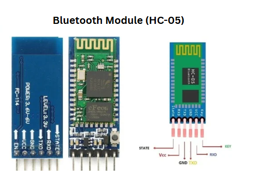
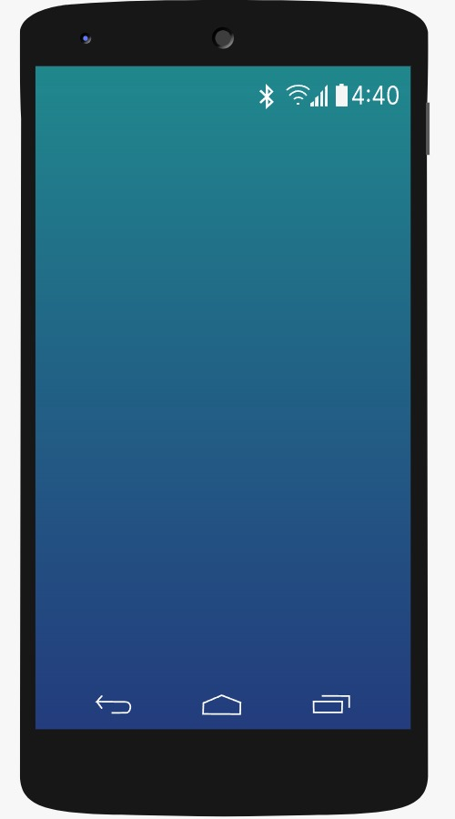

Bluetooth technology has become a mainstream communication standard in embedded and IoT systems, offering a reliable method for wireless data exchange over short distances. With built-in **Bluetooth** capability, the **Raspberry Pi** is an ideal platform for building Bluetooth-based data transfer systems.

#### Bluetooth on Raspberry Pi

The Raspberry Pi supports **Bluetooth 4.1 or higher**, enabling it to communicate with a wide range of peripherals including smartphones, keyboards, sensors, and HC-series modules. Bluetooth is designed for **low-power, short-range** communication (typically up to 10 meters), making it suitable for mobile and battery-powered projects.

Using Bluetooth, the Raspberry Pi can:
- **Send sensor data** to a smartphone in real time  
- **Receive commands** from a mobile app (e.g., to control GPIO devices)  
- **Transfer files** wirelessly without needing an internet connection

The Pi can function either as a **Bluetooth server** (waiting for connections) or a **Bluetooth client** (initiating connections). Communication is typically handled via the **Serial Port Profile (SPP)**, which emulates serial communication over Bluetooth and is widely supported in Android development.

#### Bluetooth Pairing and Communication

To initiate communication, a **pairing process** must occur between the Raspberry Pi and the smartphone. Pairing ensures:
- **Device discovery** (using `bluetoothctl` or GUI tools)  
- **Secure authentication**  
- **Persistent bonding** so devices can reconnect automatically in future sessions

#### Components Required

 1. Raspberry Pi (with built-in Bluetooth)
- Serves as the core processing and communication unit  
- Runs the Python script to handle Bluetooth communication logic  
- Interfaces with external modules (like HC-05) via UART or internal Bluetooth  
  

 2. HC-05 Bluetooth Module (if used)
- A Bluetooth SPP module used for serial communication  
- Connected via the Pi’s UART (TX/RX) pins  
- Useful when internal Bluetooth is reserved or additional range is needed  
- Requires proper voltage level shifting for compatibility  
  

3. Android Smartphone (Android 4.2 or above)
- Acts as the Bluetooth client or server  
- Used to receive data, send commands, or test the pairing and communication  
- Can display received data via mobile apps or custom interfaces  
  

#### Explanation of Each Connection

##### HC-05 to Raspberry Pi Connections

- Connect the **Vcc** pin of the HC-05 Bluetooth module to the **5V** power pin of the Raspberry Pi  
- Connect the **TX** pin of the HC-05 to the **RX (UART0 RX)** pin on the Raspberry Pi  
- Connect the **RX** pin of the HC-05 to the **TX (UART0 TX)** pin on the Raspberry Pi  
- Connect the **GND** pin of the HC-05 to the **GND** pin on the Raspberry Pi

##### Smartphone Bluetooth Pairing Steps

- On the smartphone, **click the Bluetooth icon** to enable Bluetooth  
- Toggle the **Bluetooth switch ON** from the device’s settings  
- Wait for the smartphone to scan and **select the Raspberry Pi** (or HC-05) from the list of available Bluetooth devices  
- Click the **Pair** button when prompted  

