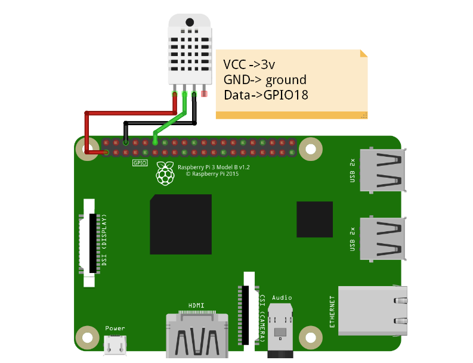

### Theory

- Bluetooth connectivity is now included in a variety of devices, including the Raspberry Pi single board, its mouse, and game controllers, thanks to the device’s Bluetooth functionality. Each Raspberry Pi 3 or Pi Zero W will come with two batteries. A Bluetooth connection with a wireless range of 115N (150 Mbit/s) and a 802.11n Wi-Fi connection.
- Bluetooth is a technology that can be used to send or receive files on the Raspberry Pi. Before the Raspberry Pi can communicate with a Bluetooth-enabled device, we must first pair it. It is the same process for a Bluetooth device to be paired to a Raspberry Pi as it is for a mobile or laptop.
- Bluetooth, which is a low-powered wireless technology, is intended to allow two devices to share data over short distances. It is critical to learn how to interact with your Raspberry Pi’s Bluetooth devices. This is the step-by-step procedure for configuring Bluetooth on the Raspberry Pi. The Raspberry Pi has a Bluetooth interface that allows you to connect to and search for Bluetooth devices. In addition to the Bluetooth adaptors, you have the option of changing the interface.
- By using Raspberry Pi Wi-Fi, this can be accomplished. To access the Raspberry Pi on a laptop, we must connect it to a wireless network after it boots. When the Raspberry Pi is connected to a Wi-Fi network, we can access it on a laptop by using its IP address. The Raspberry Pi can receive data via Bluetooth. This is possible because the Raspberry Pi has a built-in Bluetooth module. The Bluetooth module allows the Raspberry Pi to wirelessly communicate with other Bluetooth-enabled devices.

 

 
 
Components required –

- Raspberry pi (Any Raspberry pi with Wi-Fi)
- Raspbian OS loaded Micro SD Card
- Android phone with 4.2 OS Jelly bean
- python run script
